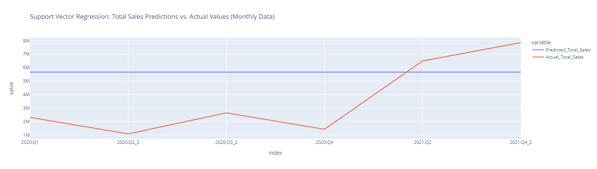

# Results of Machine Learning Analysis
## Unsupervised Machine Learning Clustering:

Using SKLearn's KMeans algorithm, we were able to cluster the US states into 5 groups based on their demographic data. The first step taken for this was a simple KMeans clustering. First using unscaled data, an elbow curve was generated to determine the optimal number of clusters.

    
Click to expand image (ML:Fig1 - KMeans Elbow Curve)

Using the elbow curve, 3D scatter plots were generated using 3 and 5 clusters.

	
Click to expand image (ML:Fig2 - KMeans K3 3D Scatter Plot)

	
Click to expand image (ML:Fig3 - KMeans K5 3D Scatter Plot)

Based on these plots, different K values seem to divide the data into groups depending almost entirely on the population size alone. In order to create more meaningful clusters, Principal Component Analysis (PCA) was used to reduce the dimensionality of the data. This was done by scaling the data and then using PCA to reduce the number of features to 3. The elbow curve was then generated again to determine the optimal number of clusters.

	
Click to expand image (ML:Fig4 - PCA Elbow Curve)

Using the elbow curve, 3D scatter plots were generated again using 3 and 5 clusters.

	
Click to expand image (ML:Fig5 - PCA K3 3D Scatter Plot)

	
Click to expand image (ML:Fig6 - PCA K5 3D Scatter Plot)

While it does seem that population size still has an influence on the clustering, the clusters are more evenly distributed and the groups are more distinct. Either three or five clusters would be a good choice depending on the level of detail desired.

## Binary Supervised Machine Learning:

Using multiple regression/classification models, we were able to predict if the operating margin for a specific product on a specific date from a specific retailer would be greater than or less than 35%. The data contains many operating margins greater than and less than 35%, this number was chosen because it is the median operating margin. 

The first step taken for this was to convert the operating margin column into a binary column. This was done by creating a new column and setting the value to 1 if the operating margin was greater than 35% and 0 if it was less than or equal to 35%. The data was then split into 70/30 training and testing data split.

### Decision Tree Classifier Results:

	
Click to expand image (ML:Fig9 - Decision Tree Classifier Confusion Matrix)

	
Click to expand image (ML:Fig10 - Decision Tree Classifier Classification Report)

With an accuracy score of 95%, the decision tree classifier provides a good model for predicting the operating margin. This model had an almost even number of false positives and false negatives and had lower precision and recall scores for negative predictions.

#### Optimizing Decision Tree Classifier:

    
Click to expand image (ML:Fig30 - Optimized Decision Tree Classifier Confusion Matrix)

    
Click to expand image (ML:Fig31 - Optimized Decision Tree Classifier Classification Report)

In order to achieve a better accuracy score, the decision tree classifier parameters were optimized by using both GridSearchCV and a multi-nested for loop in case one or the other was unable to find the best parameters. The optimized decision tree classifier was only able to very slightly improve the accuracy score and all precision and recall scores. The optimized confusion matrix also shows mixed results, with less true negatives, more false positives, less false negatives, and more true positives.

### Random Forest Classifier Results:

	
Click to expand image (ML:Fig11 - Random Forest Classifier Confusion Matrix)

	
Click to expand image (ML:Fig12 - Random Forest Classifier Classification Report)

With an accuracy score of 96%, the random forest classifier also provides a good model for predicting the operating margin. This model had double the number of false negatives compared to false positives and lacked in negative recall, but had 99% positive recall score.

#### Optimizing Random Forest Classifier:

    
Click to expand image (ML:Fig32 - Optimized Random Forest Classifier Confusion Matrix)

    
Click to expand image (ML:Fig33 - Optimized Random Forest Classifier Classification Report)

In order to achieve a better accuracy score, the random forest classifier parameters were optimized by using both GridSearchCV and a multi-nested for loop in case one or the other was unable to find the best parameters. The optimized random forest classifier had mixed results, with a slightly lower accuracy score, negative recall score and positive precision score, but a higher negative precision score and an unchanged positive recall score. The optimized confusion matrix also shows mixed results, with less true negatives, more false positives, less false negatives, and more true positives.

### Gradient Boosting Classifier Results:

	
Click to expand image (ML:Fig13 - Gradient Boosting Classifier Confusion Matrix)

	
Click to expand image (ML:Fig14 - Gradient Boosting Classifier Classification Report)

With an accuracy score of 95%, the gradient boosting classifier also provides a good model for predicting the operating margin. Similar to the decision tree classifier, this model had an almost even number of false positives and false negatives and had lower precision and recall scores for negative predictions.

#### Optimizing Gradient Boosting Classifier:

    
Click to expand image (ML:Fig34 - Optimized Gradient Boosting Classifier Confusion Matrix)

    
Click to expand image (ML:Fig35 - Optimized Gradient Boosting Classifier Classification Report)

In order to achieve a better accuracy score, the random forest classifier parameters were optimized by using both GridSearchCV and a multi-nested for loop in case one or the other was unable to find the best parameters. The optimized gradient boosting classifier showed the most improved results with a higher accuracy score, up to 99%, with minor to large improvements in all precision and recall scores. The optimized confusion matrix also shows better results, with more true negatives, much less false positives, less false negatives, and more true positives. This optimized model is the best model for predicting the operating margin.

### SMOTEENN Results:

	
Click to expand image (ML:Fig15 - SMOTEENN Confusion Matrix)

	
Click to expand image (ML:Fig16 - SMOTEENN Classification Report)

With an accuracy score of 95%, the SMOTEENN model also provides a good model for predicting the operating margin. Unlike the other models however, this model had a significantly higher number of false positives but a very low number of false negatives. This model seems to have worked opposite of the random forest classifier, where this model lacked in negative recall but had 99% positive recall score.

## Predictive Multiple Linear Regression Machine Learning:

Using multiple regression models, we were able to predict the total sales and operating profit for the company as a whole per month. The independent variables used for this was quarterly high-level demographic data including, total population of the United States of America, total personal income and per capita personal income. While the dependent variables were the total sales and operating profit for the company as a whole per month.

The first model created was trained and tested with quarterly data, knowing that the extremely small sample size of only eight data points would not be enough to create a particularly accurate model. All following models were trained and tested with monthly data. However, since the demographic data was only available quarterly, that data was duplicated for each month in the quarter.

The measure of accuracy used for the following models was the Root Mean Squared Error (RMSE). The RMSE is the square root of the mean of the squared differences between the predicted values and the actual values. The lower the RMSE, the better the model. For the purposes of this data, the RMSE represents the average difference between the predicted value and the actual value in dollars. For example, if the RMSE is 100,000, then the average difference between the predicted value and the actual value is $100,000.

### Random Forest Regressor Results:
Using random forest regression first on the quarterly data resulted in an RMSE of ~3,856,909. Considering that the minimum values in this dataset range from 1,500,000 to 2,000,000, this is quite a large error value.

    
Click to expand image (ML:Fig20 - Random Forest Regressor (Quarterly Data))

When this same model was trained and tested on the monthly data, the RMSE was reduced to ~908,263. This is a more reasonable but still a relatively large RMSE value, considering that the minimum values in this dataset range from 300,000 to 500,000.

    
Click to expand image (ML:Fig22 - Random Forest Regressor (Monthly Data))

#### Optimizing the Random Forest Regressor Model:
In order to optimize the random forest regression model and reduce the RMSE value, first the GridSearchCV function was used. This function takes a dictionary of parameters and a model and returns the best parameters for that model. Using the quarterly data, the RMSE was reduced by 3,770 to ~3,860,686 with this method. However, after doing some manual iterations of the parameters, it was found that the RMSE could be reduced further. While GridSearchCV should be able to find the best parameters, it is possible that the extremely small sample size of only eight data points is not enough for the function to properly work. Therefore a multi-nested for loop was used to manually iterate through all parameters and was successful in reducing the RMSE by an additional 152,528 to ~3,708,158.

    
Click to expand image (ML:Fig21 - Optimized Random Forest Regressor (Quarterly Data))

The same methods mentioned above (including the GridSearchCV) were used to optimize the random forest regression model for the monthly data. While the GridSearchCV function was able to reduce the RMSE by 84,096 to ~824,167, the for loop was  able to reduce the RMSE by an additional 54,692 to ~769,475.

    
Click to expand image (ML:Fig23 - Optimized Random Forest Regressor (Monthly Data))

Because of the expectedly large difference in RMSE values between the quarterly and monthly data, all following models were trained and tested only on the monthly data.

### Support Vector Regression Results:
Using support vector regression on the monthly data resulted in an RMSE of ~3,288,750. For unknown reasons, this model only produced a single prediction value for each month, which is the reason for the large RMSE value.

    
Click to expand image (ML:Fig24 - Support Vector Regression (Monthly Data))

#### Optimizing the Support Vector Regression Model:
Using the GridSearchCV function, the RMSE was reduced by 2,218 to ~3,286,532. However, this model still only produced a single prediction value for each month.

    
Click to expand image (ML:Fig25 - Optimized Support Vector Regression (Monthly Data))

### Decision Tree Regression Results:
Using decision tree regression on the monthly data resulted in an RMSE of ~893,761. This model resulted in only a slightly better RMSE value than the random forest regression model, and all of the predicted values were about the same.

    
Click to expand image (ML:Fig26 - Decision Tree Regression (Monthly Data))

#### Optimizing the Decision Tree Regression Model:
Using the GridSearchCV function with the addition of a dedicated scoring metric (mse = make_scorer(mean_squared_error, greater_is_better=False)), the RMSE was somehow massively increased to ~1,473,184. However, using a for loop to manually iterate through the parameters resulted in an RMSE even better than that of the optimized random forest regression model at ~618,379.

    
Click to expand image (ML:Fig27 - Optimized Decision Tree Regression (Monthly Data))

Notably, this model was the only one which did not produce significantly inaccurate predictions for 2020:Q2_3 and 2021:Q2.

### XGBoost Regression Results:
Using XGBoost regression on the monthly data resulted in an RMSE of ~893,759. This model again resulted in only a slightly better RMSE value than the random forest regression model, and all of the predicted values were about the same.

    
Click to expand image (ML:Fig28 - XGBoost Regression (Monthly Data))

#### Optimizing the XGBoost Regression Model:
Using the GridSearchCV function with the addition of a dedicated scoring metric (mse = make_scorer(mean_squared_error, greater_is_better=False)), the RMSE was somehow again increased to ~930,933. However, using a for loop to manually iterate through the parameters resulted in a better RMSE of ~860,717.

    
Click to expand image (ML:Fig29 - Optimized XGBoost Regression (Monthly Data))

