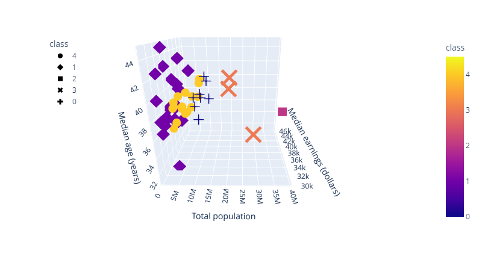
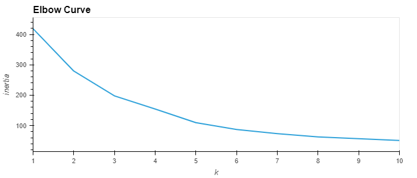
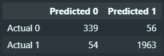
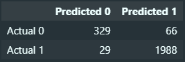
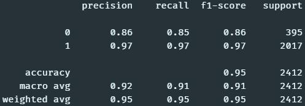
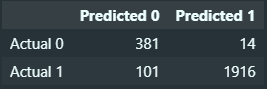

# Final Project
 
 ## Project Idea
 
Analyzing the Adidas Sales Data 2020-2022 from 6 retailers across all 50 states in the US and referencing that against US demographics data to build a machine learning model that can predict future sales trends in total sales and operating income based on age group, gender and household income.
 
## Description of Data
 
Adidas, a global sportswear company, saw a decline in sales during the 2020-2022 period, primarily due to the impact of the COVID-19 pandemic on the retail industry. In 2020, Adidas reported a decline in sales of 8% compared to the previous year. However, in 2021, the company saw a rebound in sales with an increase of 8% compared to 2020. This was due in part to the reopening of brick-and-mortar stores and the increasing demand for athletic wear as people returned to sports and fitness activities. Additionally, the company's e-commerce sales also increased significantly during this time period, as more consumers turned to online shopping. Despite the challenging economic conditions, Adidas was able to maintain profitability during this period through cost-saving measures and a focus on digital sales channels. The data we are analyzing is the Adidas Sales Data 2020-2022 from 6 retailers across all 50 states in the US.

## Description of data files

- Adidas US Sales Datasets.xlsx - Raw Data file exported from kaggle.com
- ETL_Process_I.ipynb - Python Notebooks used to clean data set 
- cleaned_adidas_sales_data.csv - Output csv file post execution first stage of ETL
- ETL_2.ipynb - Generate lookup tables for the relational database
- Adidas_sales.csv - Adidas Sales Dataset
- Retailers.csv - Retailers Lookup table
- States.csv - States Lookup table
- Regions.csv - Regions Lookup table
- Products.csv - Products Lookup table
- Tableau.csv - Clean dataset for Tableau visualizations & dashboard
- ERD.png -  Relational schema generated from quickdbd
- ERD.sql - Query file to generate tables in relational database
- US_Population_Data folder - US Census Data for 2020 from United States Census Bureau
- Canada_Population_Data folder - Canada Census Data for 2020 from Statistics Canada

 
 ## Entity Relationship Diagram
 
 Based on the original dataset we were able to extract these table to help categorize the sales data into Retailers, Product, Region and States;
 

 ## Machine Learning

Using various Machine Learning algorithms, we will be predictiong our Target variables which are "Total Sales" and "Opertating Margin" columns from our dataset. We will be dropping unnecessary columns from our dataset which are not needed for data training purposes. 
 
 Using get_dummies() method, we will be converting some of our Feature variables into Binary. We will be testing our data on different Machine Learning algorithms namely Multiple Linear Regression, Random Forest etc. in order to check  which is the best fit for closest prediction.

 
 Scikit-learn, a python machine learning library will be used to implement supervised learning model. Following procedure will be used on dataset:
 
 - create a model ( using sklearn to implement linear regression) 
 - train the model (passing on Feature variables to train model)
 -  make predictions (predicting Target variable (total sales or Operating Margin))

Multiple Linear Regression:
- Input Data:
	- Total daily income per state
	- Date
- Output Data:
	- Prediction of future daily income per state

Unsupervised Machine Learning Clustering:
- Input Data:
	- Dimensionality reduction/scaling of demographic data (per state and province)
- Output Data:
	- Categorized groupings of similar states/provinces

### Results

#### Unsupervised Machine Learning Clustering:

Using SKLearn's KMeans algorithm, we were able to cluster the US states into 5 groups based on their demographic data. The first step taken for this was a simple KMeans clustering. First using unscaled data, an elbow curve was generated to determine the optimal number of clusters.

    
Click to expand image (ML:Fig1 - KMeans Elbow Curve)

Using the elbow curve, 3D scatter plots were generated using 3 and 5 clusters.

	
Click to expand image (ML:Fig2 - KMeans K3 3D Scatter Plot)

	
Click to expand image (ML:Fig3 - KMeans K5 3D Scatter Plot)

Based on these plots, different K values seem to divide the data into groups depending almost entirely on the population size alone. In order to create more meaningful clusters, Principal Component Analysis (PCA) was used to reduce the dimensionality of the data. This was done by scaling the data and then using PCA to reduce the number of features to 3. The elbow curve was then generated again to determine the optimal number of clusters.

	
Click to expand image (ML:Fig4 - PCA Elbow Curve)

Using the elbow curve, 3D scatter plots were generated again using 3 and 5 clusters.

	
Click to expand image (ML:Fig5 - PCA K3 3D Scatter Plot)

	
Click to expand image (ML:Fig6 - PCA K5 3D Scatter Plot)

While it does seem that population size still has an influence on the clustering, the clusters are more evenly distributed and the groups are more distinct. Either three or five clusters would be a good choice depending on the level of detail desired.

#### Binary Supervised Machine Learning:

Using multiple regression/classification models, we were able to predict if the operating margin for a specific product on a specific date from a specific retailer would be greater than or less than 35%. The data contains many operating margins greater than and less than 35%, this number was chosen because it is the median operating margin. 

The first step taken for this was to convert the operating margin column into a binary column. This was done by creating a new column and setting the value to 1 if the operating margin was greater than 35% and 0 if it was less than or equal to 35%. The data was then split into 70/30 training and testing data split. The training data was used to train the model and the testing data was used to test the model.

Decision Tree Classifier Results:

	
Click to expand image (ML:Fig9 - Decision Tree Classifier Confusion Matrix)

	
Click to expand image (ML:Fig10 - Decision Tree Classifier Classification Report)

With an accuracy score of 95%, the decision tree classifier provides a good model for predicting the operating margin. This model had an almost even number of false positives and false negatives and had lower precision and recall scores for negative predictions.

Random Forest Classifier Results:

	
Click to expand image (ML:Fig11 - Random Forest Classifier Confusion Matrix)

	
Click to expand image (ML:Fig12 - Random Forest Classifier Classification Report)

With an accuracy score of 96%, the random forest classifier also provides a good model for predicting the operating margin. This model had double the number of false negatives compared to false positives and lacked in negative recall, but had 99% positive recall score.

Gradient Boosting Classifier Results:

	
Click to expand image (ML:Fig13 - Gradient Boosting Classifier Confusion Matrix)

	
Click to expand image (ML:Fig14 - Gradient Boosting Classifier Classification Report)

With an accuracy score of 95%, the gradient boosting classifier also provides a good model for predicting the operating margin. Similar to the decision tree classifier, this model had an almost even number of false positives and false negatives and had lower precision and recall scores for negative predictions.

SMOTEENN Results:

	
Click to expand image (ML:Fig15 - SMOTEENN Confusion Matrix)

	
Click to expand image (ML:Fig16 - SMOTEENN Classification Report)

With an accuracy score of 95%, the SMOTEENN model also provides a good model for predicting the operating margin. Unlike the other models however, this model had a significantly higher number of false positives but a very low number of false negatives. This model seems to have worked opposite of the random forest classifier, where this model lacked in negative recall but had 99% positive recall score.

## Exploratory Data Analysis & Tableau Visualizations

The following is an exhaustive list of various exploratory data analysis and visualization to be executed with Tableau & SQL using the Adidas Sales Dataset. The outcome will be based on what is relevant to the final presentation:

### Visualizations based on US Census Data

1. Map of US population by State.
2. Ordered Bar Chart or line graph of US population by total, male and female.
3. Ordered Bar Chart or line graph of median age by total, male and female.
4. Map of median income earnings by State
5. Median Age Vs. Income Earnings Graph (Ordered by Income)
6. Sex Ratio Vs. Income Earnings Graph (Ordered by Income)

### Visualizations based on Adidas Sales Data
 
#### Overall Dashboard
 
1. Add some Demographic Data from US Census
2. Total Sales for Adidas for 2020 and 2021
3. Total Operating Profit for Adidas for 2020 and 2021
4. Total Retailers, Regions, States, Product Categories (General Overview)

#### Retailer Dashboard

5. Retailer Presence by State
6. Total Sales by Retailer (Total, Region, State, Product Category, Sales Method)
7. Total Units Sold by Retailer (Total, Region, State, Product Category, Sales Method)
8. Operating Profit by Retailer (Total, Region, State, Product Category, Sales Method)
9. Average Operating Margin of Retailer (Total, Region, State, Product Category, Sales Method)

#### Product Dashboard

10. Total Sales by Product (Total, Region, State, Retailer, Sales Method)
11. Total Units Sold by Product (Total, Region, State, Retailer, Sales Method)
12. Average Operating Profit Margin by Product (Total, Region, State, Retailer, Sales Method)
13. Operating Profit by Product (Total, Region, State, Retailer, Sales Method)
14. Average Retail Price by Product (Total, Region, State, Retailer, Sales Method)

#### Sales Method Dashboard

15. Total Sales by Method (Total, Region, State, Retailer, Product Category)
16. Total Units Sold by Method (Total, Region, State, Retailer, Product Category)
17. Average Operating Profit Margin by Method (Total, Region, State, Retailer, Product Category)
18. Operating Profit by Method (Total, Region, State, Retailer, Product Category)
19. Average Retail Price by Method (Total, Region, State, Retailer, Product Category)

#### State Sales Dashboard

20. Total Sales by State (Total, Retailer, Product Category, Sales Method)
21. Total Units Sold by State (Total, Retailer, Product Category, Sales Method)
22. Average Operating Profit Margin by State (Total, Retailer, Product Category, Sales Method)
23. Operating Profit by State (Total, Retailer, Product Category, Sales Method)
24. Average Retail Price by State (Total, Retailer, Product Category, Sales Method)

#### Dashboard on Performance Metrics

25. Relationship between Price Per Unit and Operating Profit Margin (Overall and Product Category)
26. Relationship between Price Per Unit and Units Sold (Overall and Product Category)
27. Relationship between Sex Ratio and Gender Category Sales (SQL output table)
28. Relationship between Income and Total Sales (SQL output table)
29. Relationship between Income and Units Sold (SQL output table)
30. Relationship between Income and Average Price Per Unit (Overall) (SQL output table)
31. Relationship between Income and Average Price Per Unit (Product Category) (SQL output table)

## Tableau Visualization

After analysing US Adidas Sales Data, few visualizations have been created using Tableau.csv file. Here is a [link]() to Tableau Public which has few worksheets regarding data analysis.
- Total sales and operating profit data  for Adidas during 2020 and 2021 has been visualized using Tableau, it is found that during Covid, Adidas suffered doing business. It is clear that sales are fairly low during 2020 as compared to 2021 [2020 Sales vs 2021 Sales](https://drive.google.com/file/d/1hxDDOUuto4EUZoEL-Ko9nEbvFHU-bbOJ/view?usp=sharing).
- Number of Sales data has been plotted against each retailer to analyse which retailer has the highest number of sales, and it is found that Foot Locker has the highest number [Number of Sales per retailer](https://drive.google.com/file/d/1_6gaHkZeQp5kQHhttA-GoXlc-FsSwIwG/view?usp=sharing).
- Comparison was drawn between Number of Sales vs Total Sales to analyse the relation between two factors for each State in US. High number of sales doesn't have a direct relation with High Total Sale. Even though, number of Sale is high, some states are lacking behind others even with total sales amount [Number of Sales vs Total Sales](https://drive.google.com/file/d/1iSVk1A1UwOpVbztXPI_qFwJDqAV8GBJl/view?usp=sharing).
- Number of Sales for each product has been plotted in a bar chart for all 5 regions.Men's Street Footwear has been recorded as the highest in Sales [Bar Chart](https://drive.google.com/file/d/1xwQR8qjL3kUPx1DthbMjR9ANZnyYHT9z/view?usp=sharing).
- Each Product sale has been visualised against each region, West region has been recorded as the highest in number of units sold. Sale of each product is recorded highest in West region [Product Sale vs Region](https://drive.google.com/file/d/1OS5u_cbZ5pBDUc-4Qi-GcwEqSinJJhwN/view?usp=sharing).
- There are three sales method in sales data file, they were visualized using pie chart feature to find out which method records the highest number. After analysing data in Tableau, online method is found to be the most preferred one with double operating profit as compared to in store or outlet purchase [Operating Profit vs payment method](https://drive.google.com/file/d/12E-zzZeewij-y4taknl8vow3_tqQB4p3/view?usp=sharing).

